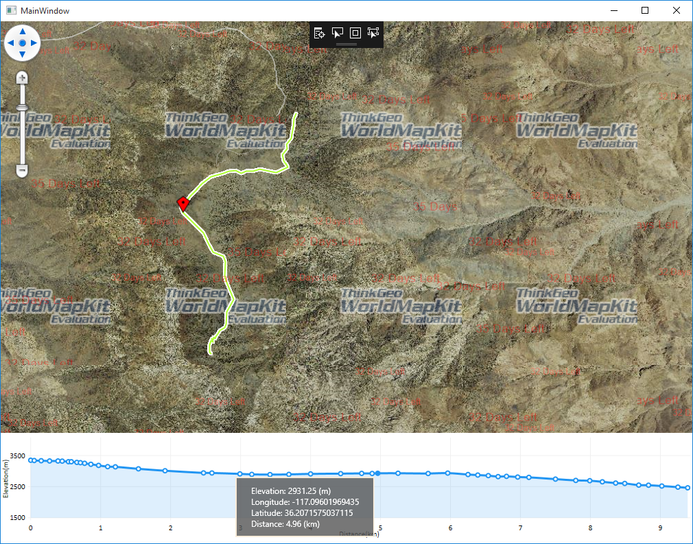

# Elevation Sample for WPF
### Description
This **Sample**   shows the elevation data of a road in the form of a line [chart][1].

- **Elevation SDK** - support query elevation data by point, points, line and polygon based on [SRTM][2] and Ned13 elevation source data.
 - **For point** - The buffer to get a point to reduce the elevation error of only one point.
 - **For points**- Each point is the same with the point.
 - **For line** - There are two ways to get the elevation data of the line. One is to get the points on the line by setting the interval distance, and the other is to take the points by setting the number of points to be fetched, and then finally to the query of the elevation data of the point.
 - **For polygon** - By setting the interval distance clip the polygon to the grids, and get all the center of the grids where the polygon is located. And then determine whether these center points are on the surface or inside the surface(use improved arc-length method).



### Requirements
This sample makes use of the following NuGet Packages

- [MapSuite 10.0.0][4]
- [AWSSDK.Core][5]
- [AWSSDK.S3][6]

### About the Code
>**Get elevation by points**
```cs
private Collection<Feature> GetElevationByPoints(Collection<PointShape> points)
{
	string sourceDir = @"..\..\source";
	Elevation elevation = new Elevation();
	elevation.ElevationFeatureSources.Add(new S3CompressedSrtmElevationFeatureSource(sourceDir + @"\index.shp", sourceDir, 3601, 3601, 1.0, 1.0, sourceDir));
	elevation.Open();
	return elevation.GetElevationByPoints(points, 4326, DistanceUnit.Meter);
}
```
> **Get elevation value and point**
```cs
foreach (var feature in features)
{
	PointShape point = new PointShape(feature.ColumnValues["point"]);
	double value = double.Parse(feature.ColumnValues["elevation"]);
}
```

### Getting Help
- [Map Suite Desktop for WPF Wiki Resources][7]
- [Map Suite Desktop for WPF Product Description][8]
- [ThinkGeo Community Site][9]
- [ThinkGeo Web Site][10]

### About Map Suite
Map Suite is a set of powerful development components and services for the .Net Framework.

### About ThinkGeo
ThinkGeo is a GIS (Geographic Information Systems) company founded in 2004 and located in Frisco, TX. Our clients are in more than 40 industries including agriculture, energy, transportation, government, engineering, software development, and defense.


  [1]: https://lvcharts.net/App/examples/v1/wpf/Basic%20Line%20Chart
  [2]: https://dds.cr.usgs.gov/srtm/version2_1/Documentation/SRTM_Topo.pdf
  [4]: https://www.nuget.org/packages?q=ThinkGeo
  [5]: https://www.nuget.org/packages?q=AWSSDK
  [6]: https://www.nuget.org/packages?q=AWSSDK
  [7]: http://wiki.thinkgeo.com/wiki/map_suite_desktop_for_wpf
  [8]: https://thinkgeo.com/desktop
  [9]: http://community.thinkgeo.com/
  [10]: https://www.thinkgeo.com/
